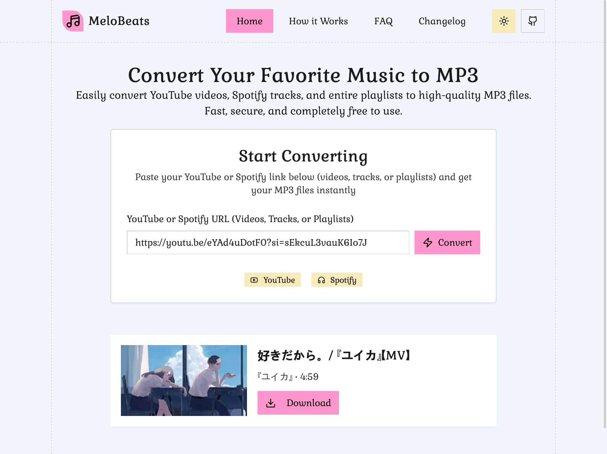
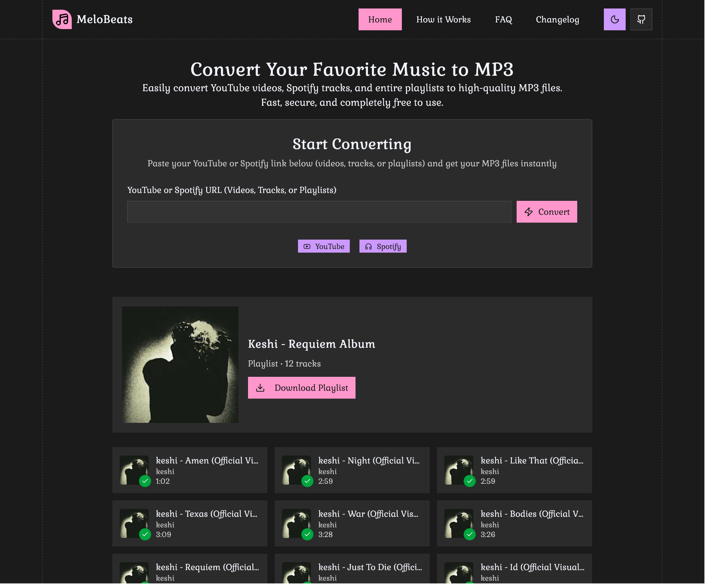
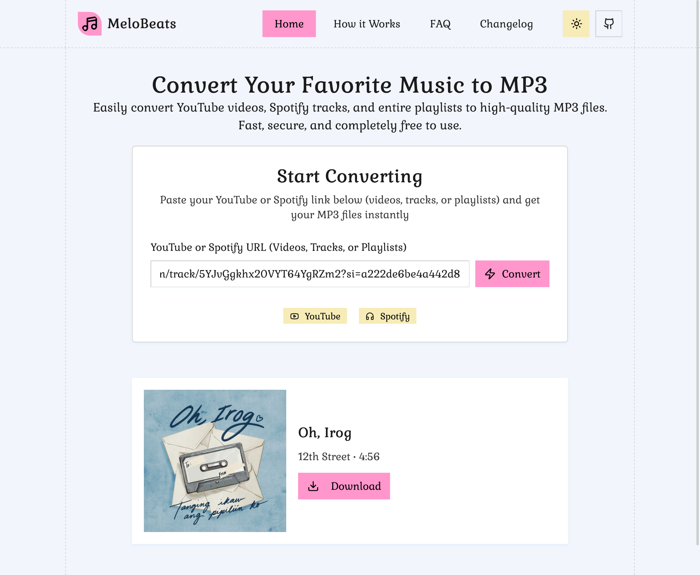
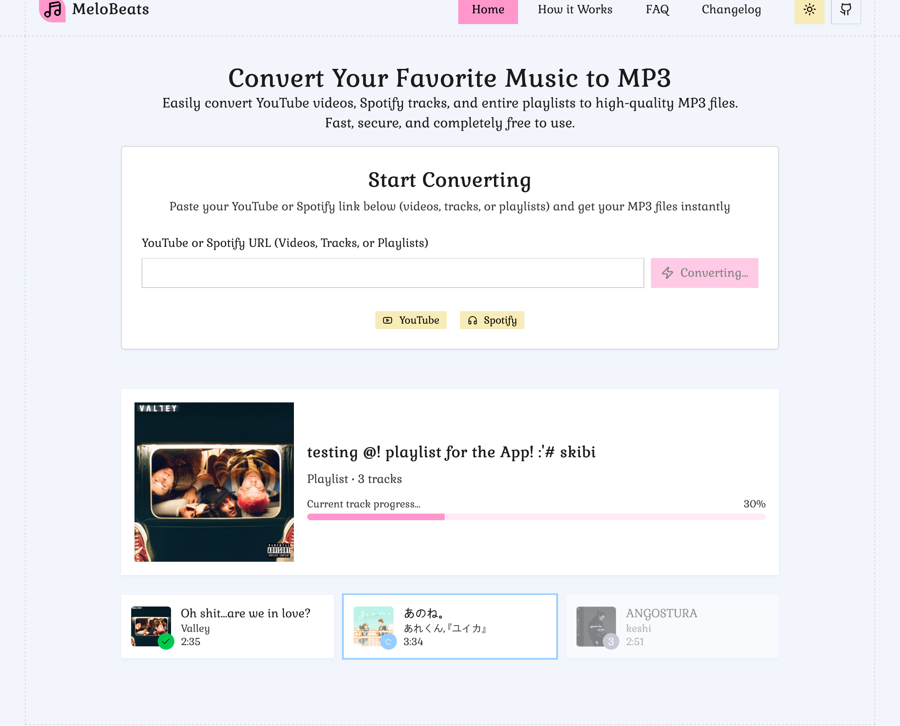

# 🎧 MeloBeats

A web application that converts YouTube and Spotify URLs (videos, tracks, or playlists) into MP3 files.

## 🚀 Features

-   Convert YouTube videos and playlists to MP3
-   Convert Spotify tracks and playlists to MP3
-   Playlists will be compressed into a ZIP file for easy download

## 📸 Screenshots






## ⚡ Tech Stack

Frontend: React, TypeScript, Vite, TailwindCSS

Backend: Node.js, Express, TypeScript

## Getting Started

### Prerequisites

-   [Node.js](https://nodejs.org/)
-   [pnpm](https://pnpm.io/) or npm

### Installation

1. **Clone the repository:**

    ```bash
    git clone https://github.com/Viadsss/MeloBeats.git
    ```

2. **Move into the project directory:**

    ```bash
    cd MeloBeats
    ```

3. **Install dependencies:**

    ```bash
    pnpm install
    ```

    > If you’re using npm, replace `pnpm` with `npm`.

4. **Set up the backend environment file:**

    ```bash
    cd backend
    cp .env.example .env
    ```

    Open `.env` and fill in the details:

    ```env
    PORT=3000 # You can change this if needed
    SPOTIFY_CLIENT_ID=your_spotify_client_id
    SPOTIFY_CLIENT_SECRET=your_spotify_client_secret
    ```

    > You can obtain your Spotify Client ID and Secret from the [Spotify Developer Dashboard](https://developer.spotify.com/dashboard/applications) after creating an app.

5. **Set up the frontend environment file:**

    ```bash
    cd frontend
    cp .env.local.example .env.local
    ```

    Open `.env.local` and configure the backend URL:

    ```env
    VITE_BACKEND_URL=http://localhost:3000
    ```

    > Make sure the URL matches the backend port you set earlier.

6. **Run the project in development mode:**

    Go back to the root directory and start both frontend and backend:

    ```bash
    pnpm run dev
    ```

    This will start the project in development mode.

7. **Build for production:**

    To build the project and preview it in production mode:

    ```bash
    pnpm run build
    pnpm run preview
    ```
